本ページは[JAWS-UGクラウド女子会 『第16回 クラウド女子会〜新年だよ！2018年を貴女はどんな年にしたい？〜』](https://cloudgirl.doorkeeper.jp/events/68614) のハンズオン企画用ページです。

# 概要

※本ハンズオンは *60分～90分* 程度を見込みます

## 全体構成-


1. [Hello Arduino !! (Lチカ)](#user-content-hello-arduino--ledをチカチカさせる-通称lチカ)
2. [温度センサーで温度を計測する](#user-content-温度センサーで温度を計測する)
3. [LoRaWANでデータ送信をしてSORACOM Harvestで可視化する](#user-content-lorawanでデータ送信をしてsoracom-harvestで可視化する)
4. [SORACOM Funnel で AWS IoT へデータを送り、CloudWatch で監視する](#ハンズオン-応用編--soracom-funnel-aws-iot-アダプタ)
5. [あとかたづけ](#user-content-あとかたづけ)

## 準備するもの

- 有効なSORACOMアカウント / 1つ
- パソコン / 1台
    - USB-Aポートを持ち、 Arduino との接続時にOSからシリアルポートとして利用可能なこと
    - [Arduino IDE](https://www.arduino.cc/en/main/software) が [インストール済み](#user-content-appendix-arduino-ideのインストールと起動方法) であること
- Arduino UNO R3 / 1つ
- Arduino UNO R3 ⇔ パソコン接続用 USBケーブル / 1本
- LoRa Arduino 開発シールド / 1式
    - [購入後の登録](#user-content-appendix-lora-arduino-開発シールドal-050-の購入後の登録) が済んでいること
- [温湿度センサー DHT11](http://akizukidenshi.com/catalog/g/gM-09876/) / 1つ

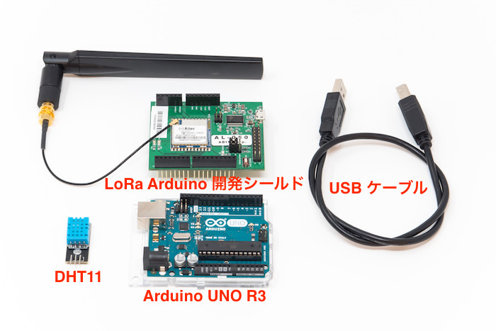

## 受講における注意点

1. 本ドキュメントで利用するサービスには一部有料のものを含んでおります (e.g. SORACOM Harvest, SORACOM Funnel)  
   受講に伴い発生した費用は原則として受講者にご負担いただいておりますので、[係る費用](https://soracom.jp/pricing/)について確認・ご理解いただいた上での受講をお願いいたします
2. 本ドキュメントで発生した不具合等につきましては弊社は一切責任を負いません

### 金額の目安

* SORACOM Harvest: 5円/LoRaデバイス/日 → 2,000回/日のリクエストに収まります
* SORACOM Funnel: 600回のリクエスト → 約1円

# ハンズオン

## Hello Arduino !! (LEDをチカチカさせる 通称:Lチカ)

**※この段階ではまだLoRa開発シールドは取り付けません**

### 1. "blink" サンプルスケッチを読み込む

Arduino IDE から **ファイル > スケッチ例 > 01.Basics > Blink** を選んでください

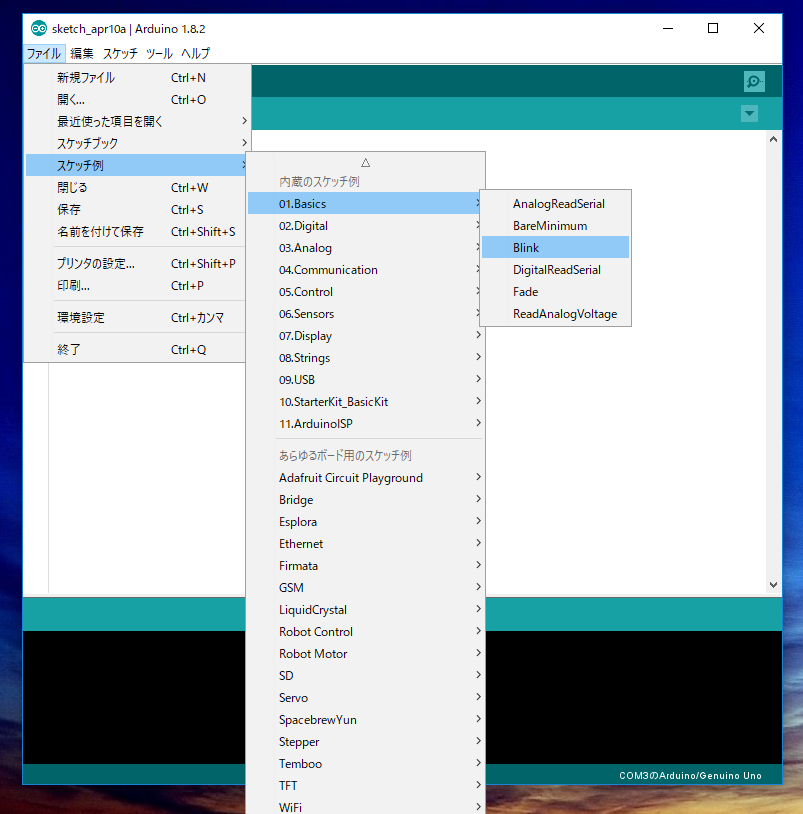

すると、新しいウィンドウで Arduino上のLEDをチカチカ点滅させる *Blink*スケッチ が開きます

### 2. コンパイル＆Arduinoへの転送を行う

*Blink*スケッチ をコンパイル＆マイコンボードへの書き込みを行います。Arduinoを接続した状態で行ってください

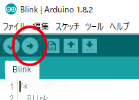

初めて Arduino を使う場合や、これまで使っていたのと違う機種の Arduino を使う場合は、書き込み時にエラーが発生するかもしれません。
その場合は「ツール」メニューから、「ボード」と「ポート」を正しく選択してください。

### 3. Arduino 上のLEDを確認する

LEDが1秒毎に点滅し始めれば成功です

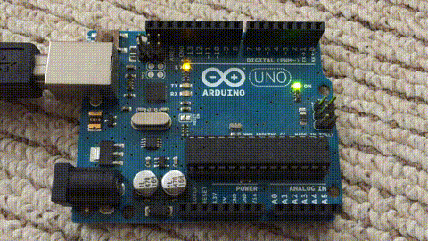

### 4. Arduino を停止する

Arduinoの停止の方法は、電源(USBケーブル)を抜くことです

マイコン全般に言えることはパソコンと違いシャットダウン処理などは原則として不要です

### トラブルシュート; コンパイル＆転送時; "指定されたファイルがありません"

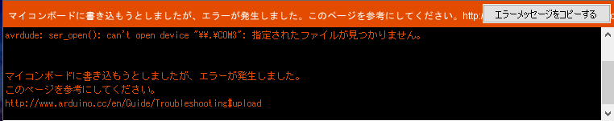

Arduinoを接続しているシリアルポートがOSから認識できていないと表示されます

* 再接続をしてみてください
* **ツール > シリアルポート**のメニューからArduinoが接続されてるシリアルポートを選択してください

## 温度度センサーで温度と湿度を計測する

それでは温湿度センサー(DHT11)を取り付け、温度と湿度を実際に計測してみましょう

**※この段階ではまだLoRa開発シールドは取り付けません**

### 1. 温湿度センサーを取り付ける

Arduinoを停止した後 温湿度センサー(DHT11) を準備し、下記の通り接続してください

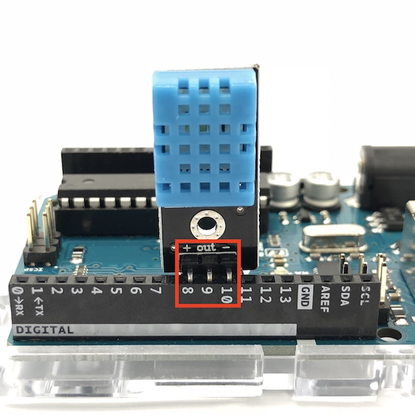

DIGITAL ピンの 8〜10 に、+ out - がそれぞれ繋がるように刺します。

**注意点**

* 温湿度センサー(DHT11)の取り付け向きに注意してください。水色の部分が外側を向きます。

### 2. 新たなスケッチを実行する

#### Arduinoとパソコンをつなげる

この時点では、前の *Blink*スケッチ が動作しているため、LEDが点滅しています

**注意点**

* この時点で温湿度センサー(DHT11)が **「触れないくらいに熱くなってきた」「焦げ臭い匂いがしてきた」** 場合は、USBケーブルを抜いてArduinoを停止し、再度接続を確認してください

#### ライブラリをインストールする
温湿度センサー(DHT11)を使用するためのライブラリをインストールします。

- メニューのスケッチ＞ライブラリをインクルード＞ライブラリを管理を選びます。
- 右上のフィルタに、SimpleDHT と入力します。
- クリックして選択をし、"インストール" を押してインストールします
- インストールがおわったら、閉じる、で閉じます。

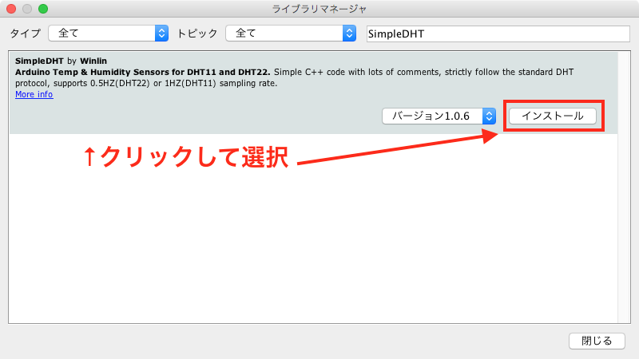

#### 新たなスケッチを作成する

**ファイル > 新規ファイル** を選択すると、新たなスケッチウィンドウが立ち上がります  
骨組みコードが書かれていますが *すべて削除したうえで* 下記スケッチを張り付けてコンパイル＆転送をしてください

※その際スケッチを保存するように言われることがありますが適切なファイル名を指定して保存してください

```c
#include <SimpleDHT.h>
#define PWR_PIN 8
#define DATA_PIN 9
#define GND_PIN 10

SimpleDHT11 dht11;

void setup() {
  Serial.begin(9600);
  pinMode(GND_PIN, OUTPUT);
  pinMode(PWR_PIN, OUTPUT);
  digitalWrite(GND_PIN, LOW);
  digitalWrite(PWR_PIN, HIGH);
  delay(1500);
}

void loop() {
  byte temperature = 0;
  byte humidity = 0;
  int err = SimpleDHTErrSuccess;
  if ((err = dht11.read(DATA_PIN, &temperature, &humidity, NULL)) != SimpleDHTErrSuccess) {
    Serial.print("Read DHT11 failed, err="); Serial.println(err);delay(1000);
    return;
  }

  Serial.print((int)temperature); Serial.print(" *C, ");
  Serial.print((int)humidity); Serial.println(" %");

  delay(1500);
}
```

#### シリアルモニタを開く

実行し始めると、先ほどまで点滅していたLEDは点灯状態となります  
計測された温度は *シリアルモニタ* というところに表示されるので、それを確認します

**ツール > シリアルモニタ** で下記のように温度と湿度が表示されていることがわかります

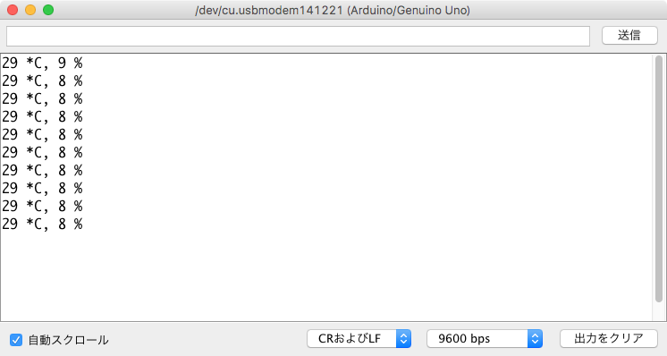

息を吹きかけたりして、温度や湿度の変化を確認してみましょう

> シリアルモニタはArduino開発で最も一般的な入出力I/Fです。

### トラブルシュート; Arduinoを停止(USBケーブルを抜いた)ら、パソコンのCPUが100%になる

"シリアルモニタ" のウィンドウを表示しているとCPU負荷がかかるようです

"シリアルモニタ" ウィンドウを閉じてください

## LoRaWANでデータ送信をしてSORACOM Harvestで可視化する

それでは温湿度センサー(DHT11)で計測した温度データをLoRaWANを経由してSORACOM Harvestに送信し可視化してみましょう

**いったんArdinoは停止し、温度センサーもすべて取り外してください**

### 1. LoRa開発シールドを取り付ける

#### Arduinoの上にLoRa開発シールドを取り付けます

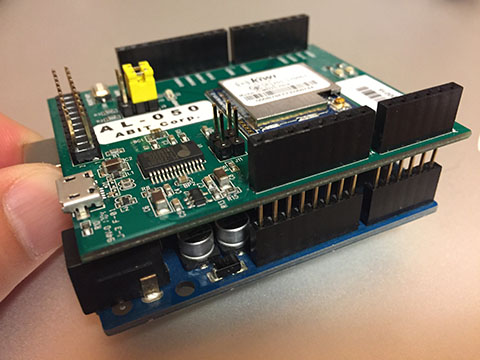

**注意点**

* LoRa開発シールドのピンは折れ曲がりやすいため、取り付け時および取り外しの際にはご注意ください（原則保証外です）

#### LoRaアンテナケーブルとアンテナを取り付けます

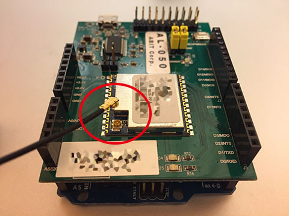

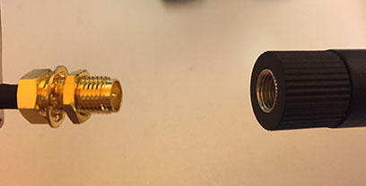

**注意点**

* LoRaアンテナケーブルのコネクタはとても小さいため、取り付けができていない場合もあります。不安がある場合はチューターにご確認ください。またコネクタを破損しないよう、取り付け時および取り外しの際にはご注意ください（原則保証外です）

### 2. 温湿度センサーを取り付ける(再)

LoRa開発シールドの上に、先ほどと同じ様に温湿度センサー(DHT11)を取り付けます
先ほどと同様に、DIGITAL ピンの 8〜10 に、+ out - がそれぞれ繋がるように刺します

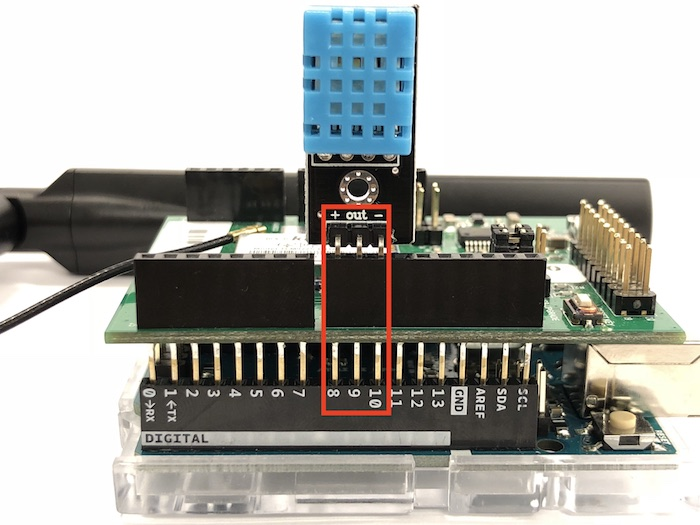


この時点で、下記のようになっているはずですので、確認をしてください

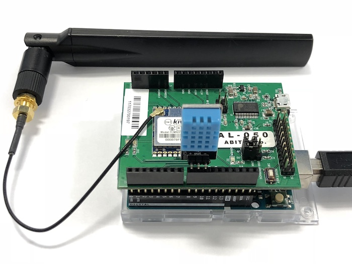

### 3. スケッチを実行する

#### SORACOM-LoRaWAN Arduinoライブラリをダウンロードする

LoRa開発シールドをArduinoで利用するには、SORACOMからリリースされているソフトウェアライブラリをスケッチに取り込む必要があります

下記から最新版のZIPファイルをダウンロードしてください

[SORACOM-LoRaWAN release ページ](https://github.com/soracom/SORACOM-LoRaWAN/releases)

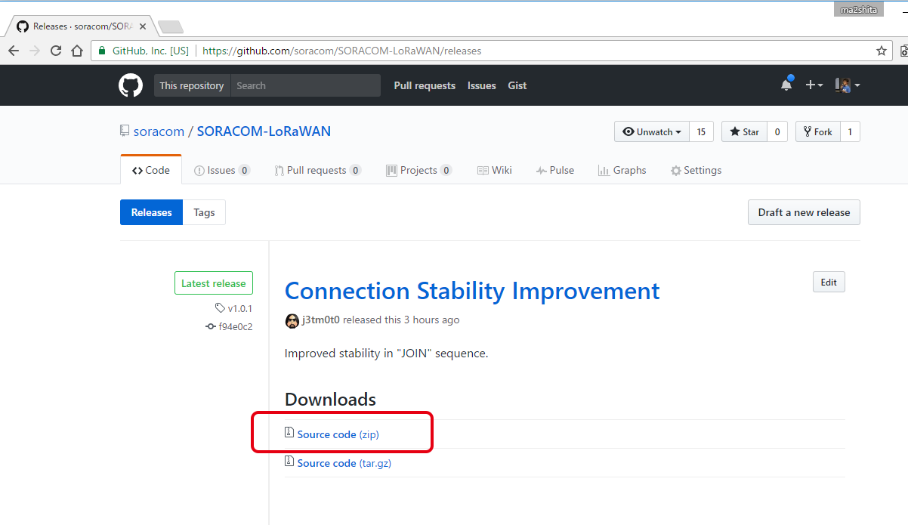

#### 新たなスケッチを作成する

1. Arduino IDE にて **ファイル > 新規ファイル** で新たなスケッチウィンドウを立ち上げます
2. **スケッチ > ライブラリをインクルード > .ZIP形式のライブラリをインストール...** で、先ほどダウンロードした *SORACOM-LoRaWAN-x.x.x.zip* を選択してください  
  
3. 骨組みコードが書かれていますが *すべて削除したうえで* 下記スケッチを張り付けてコンパイル＆転送をしてください

```c
#include <lorawan_client.h>
#include <SimpleDHT.h>

#define DATA_PIN 9
#define POWER_PIN 8
#define GND_PIN 10
#define INTERVAL 60000
#define WAKEUP_WAIT 1500

LoRaWANClient client;
SimpleDHT11 dht11;

void setup() {
  pinMode(GND_PIN, OUTPUT);
  pinMode(POWER_PIN, OUTPUT);
  digitalWrite(GND_PIN, LOW);
  digitalWrite(POWER_PIN, HIGH);

  Serial.begin(9600);
  Serial.println("Connecting ... \n");
  if(! client.connect())
  {
    Serial.println(" failed to connect. Halt...");
    for(;;){};
  }
  Serial.println("\nConnected.\n");
}

void loop() {
  unsigned long t, p;
  t=millis();

  byte temperature = 0;
  byte humidity = 0;
  int err = SimpleDHTErrSuccess;
  if ((err = dht11.read(DATA_PIN, &temperature, &humidity, NULL)) != SimpleDHTErrSuccess) {
    Serial.print("Read DHT11 failed, err="); Serial.println(err);delay(1000);
    return;
  }
  Serial.print((int)temperature); Serial.print(" C, ");
  Serial.print((int)humidity); Serial.println(" % ");

  p = ( (unsigned long)temperature << 16 ) + (unsigned long)humidity;

  client.sendData( p );

  delay(t+INTERVAL-millis()); // Wait for next loop
}
```

#### シリアルモニタを開く

実行し始めると、シリアルモニタは下記通りとなり、テキスト・JSONそれぞれの形式で温度が表示されるのと同時に、LoRaWAN通信をしている様子が確認できます


### 4. SORACOM Harvestの設定をする

#### LoRaデバイスの登録状況を確認する

[ソラコムコンソール](https://console.soracom.io)にログインし **Menu > LoRa デバイス管理** をクリックします

ここには[LoRa開発シールド購入後の登録](#user-content-appendix-lora-arduino-開発シールドal-050-の購入後の登録)が完了しているデバイスが表示されています

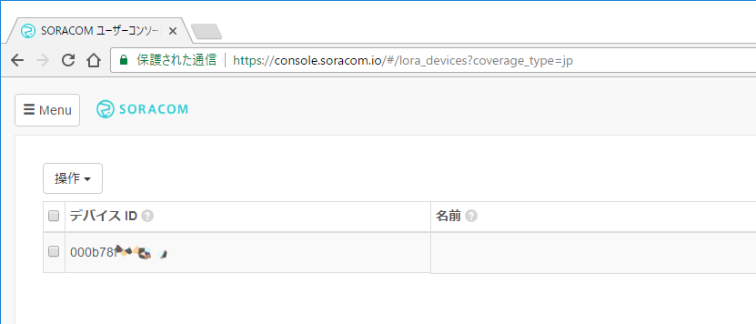

表示されていない、対象のデバイスが無い場合は、まず[LoRa開発シールド購入後の登録](#user-content-appendix-lora-arduino-開発シールドal-050-の購入後の登録)を行ってください

#### LoRaグループを追加する

**Menu > LoRaグループ** をクリックすると、LoRaグループ一覧が表示されます。この画面で **追加** をクリックします

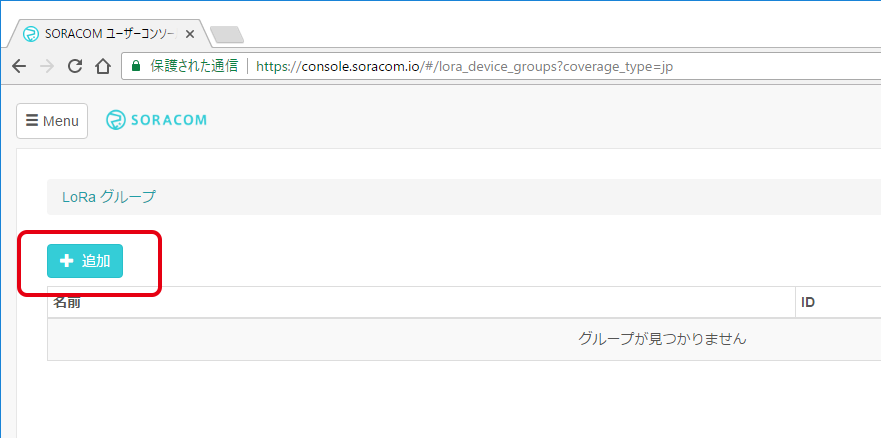

ダイアログで下記の通り設定した後、**グループ作成** をクリックします

* グループ名: `lora_demo0`

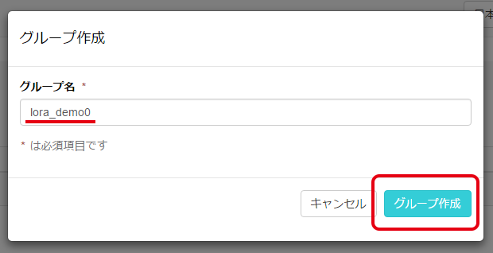

下記の通り、先ほど作成した `lora_demo0` が一覧に表示されます

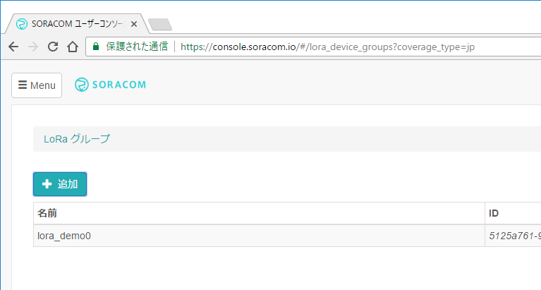

#### LoRaグループにSORACOM Harvestの設定を施す

LoRaグループ一覧の中から `lora_demo0` をクリックします

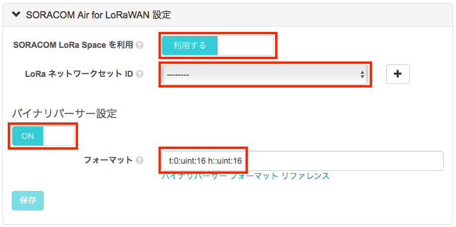

**SORACOM Air for LoRaWAN 設定** を下記の通りにしてください  

* SORACOM LoRa Space を利用: **利用する**
* LoRa ネットワークセットID: **------**
* バイナリパーサー設定: ON
* フォーマット: `t:0:uint:16 h::uint:16`

> バイナリパーサーの設定内容については、[Appendix](#appendix-バイナリパーサー設定) を参照してください

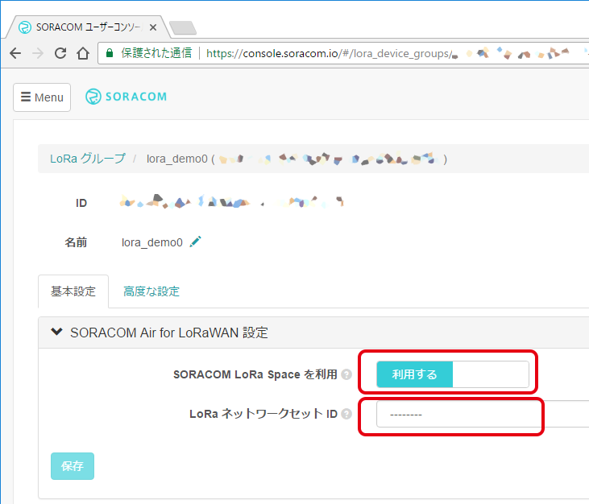

同じページ内の **SORACOM Harvest 設定** を下記の通りにした後 **保存** をクリックしてください

* **ON**

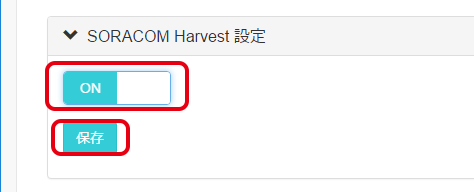

下記のダイアログが出ますので **OK** をクリックしてください

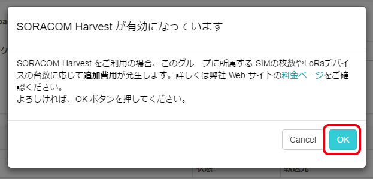

#### LoRaデバイスをLoRaグループに所属させる

**Menu > LoRaデバイス管理** をクリックして、LoRaデバイス一覧を表示します

先ほど作成した `lora_demo0` LoRaグループに所属させたいLoRaデバイスのチェックボックスを選択した後、**操作 > 所属グループ変更**をクリックしてください

ダイアログにて下記のように設定した後 **グループ変更** をクリックしてください

* 新しい所属グループ: `lora_demo0`

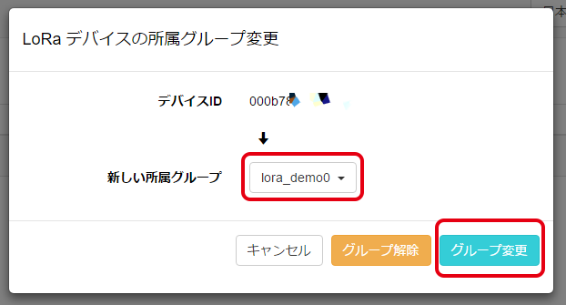

### 5. データの確認をする

LoRaデバイスをSORACOM Harvestが有効なLoRaグループに所属させた直後から、データの可視化が始まります  
※SORACOM Air for セルラーのようにセッションの再接続が不要です

**Menu > LoRaデバイス管理** をクリックし、データを表示させたいLoRaデバイスのチェックボックスを選択した後、**操作 > データを確認** にてデータを確認することができます

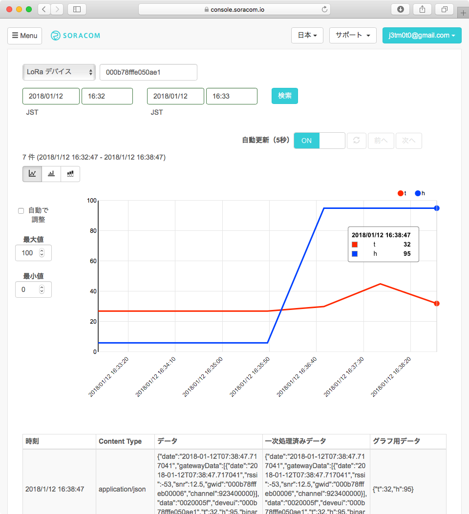

#### 変化を楽しむ

温湿度センサー(DHT11)に息を吹きかけたりすると、温度や湿度が変化します

SORACOM Harvestは標準では手動での表示更新であるため更新ボタンを押す、もしくは自動更新をONにしてください

#### トラブルシュート; sendCmd: lorawan join otta の結果が "unseccess"

何回も *unsuccess* が表示される場合、LoRaWAN通信に失敗しています


* LoRaWAN ゲートウェイと通信できる距離・環境であるか確認してください
* LoRa開発シールドとLoRaアンテナの接続を確認してください

#### トラブルシュート; SORACOM Harvestにデータが表示されない

* 表示期間が合ってないことがあります。調整してみてください

# ハンズオン (応用編 / SORACOM Funnel AWS IoT アダプタ)

2017/4/6にリリースされた [SORACOM Funnel](https://soracom.jp/services/funnel/) の新しいアダプタ [SORACOM Funnel AWS IoT Adapter](https://blog.soracom.jp/blog/2017/04/06/funnel-aws-iot/) を利用して、LoRaデバイスからのデータを[AWS IoT](https://aws.amazon.com/jp/iot/)に送り、CloudWatch　で監視をしてみましょう。

## 対象者

* 有効なAWSアカウントを持っている
    * 本ハンズオンにおいては有料サービスを利用するため課金されることをご理解ください
    * AWSの基本的なサービスは利用可能である
        * Amazon EC2のインスタンス作成・停止などの操作が行える
        * Amazon S3のバケット作成・削除などの操作が行える
        * AWS IAMのロールやポリシーを理解し、作成・削除などの操作が行える

## 全体構成


### 解説

SORACOM Air for LoRaWAN から SORACOM Funnel を通過して AWS IoT に届いたデータに含まれる 湿度を CloudWatch へ Custom Metrics として渡します。
湿度が一定値（４０％）を切った場合にメールで通知を行うような仕組みを、CloudWatch Alarm として作成します。

## AWS IAM ユーザを作成する
AWS IoT へデータを送信する事が出来るユーザを作成します。

- [こちらのリンク](https://console.aws.amazon.com/iam/home?region=ap-northeast-1&state=hashArgs%23#/users$new?step=details)から、AWS IAM のコンソールを開きます

- ユーザ名は、"AWSIoT"等、わかりやすい名前をつけ、APIキーが必要なので "プログラムによるアクセス" のチェックボックスを付け、次のステップへ進みます
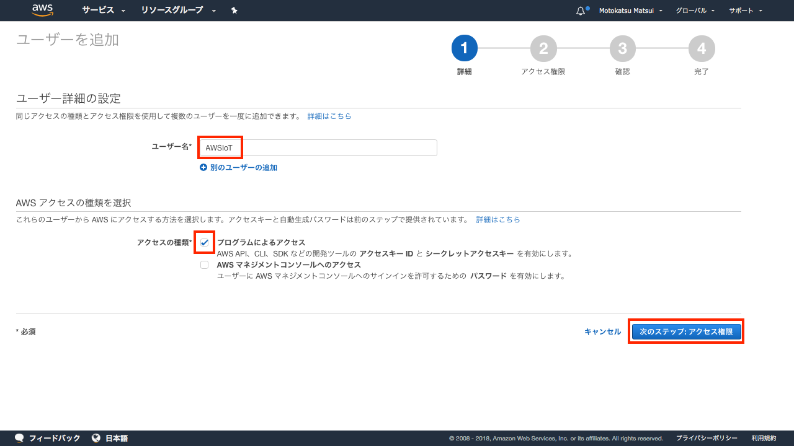

- 既存のポリシーを直接アタッチを選び、`iotdata` と検索窓に入れ、`AWSIoTDataAccess` にチェックボックスを入れ、次のステップに進みます
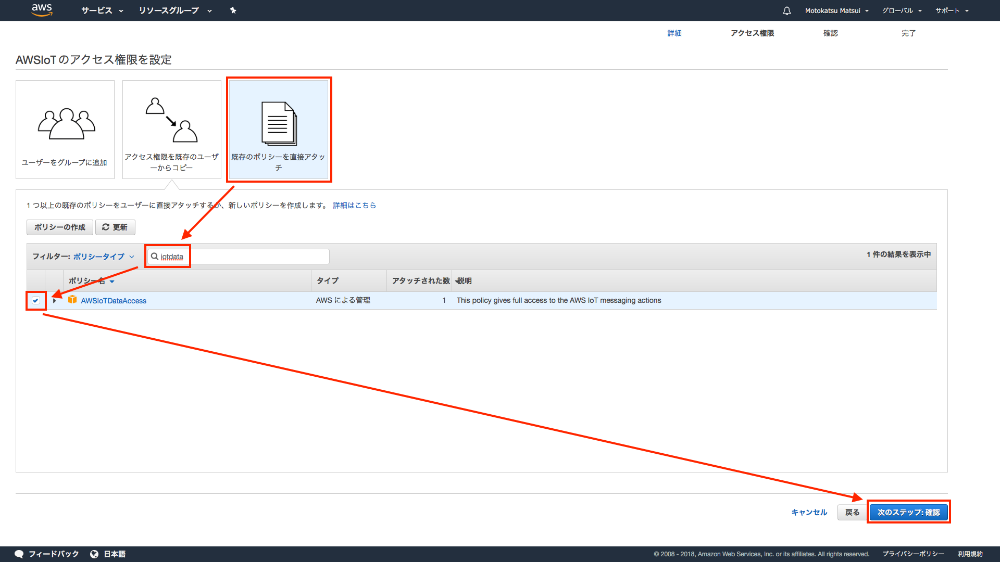

- 確認画面で、ユーザの作成をクリックします

- 完了画面では、アクセスキーIDと、シークレットアクセスキーをどこかに保存しておきます(CSVファイルをダウンロードしてもよい)
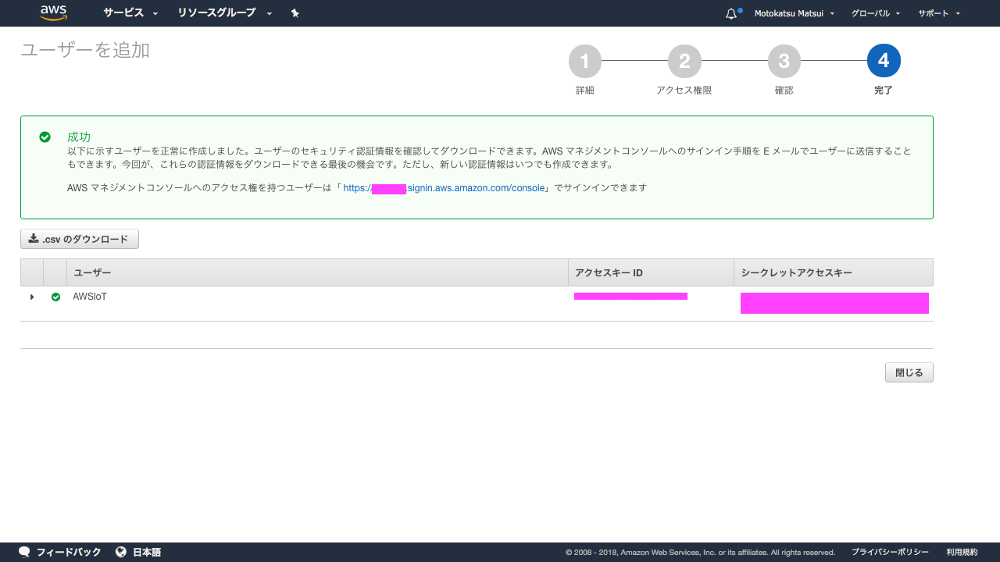

## SORACOM Funnel 設定を行う
- Menu > LoRaグループ をクリックすると、LoRaグループ一覧が表示されます
LoRaグループ一覧の中から lora_demo0 をクリックします

- SORACOM Funnel 設定を開いて、設定を ON にし、転送先サービスから AWS IoT を選びます
- 転送先URLは、`https://data.iot.ap-northeast-1.amazonaws.com/sensor` と入力します
- 認証情報の右の ＋ ボタンを押します
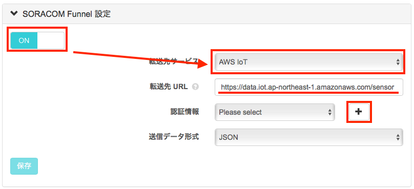

- 先ほど作成した IAM ユーザの認証情報を入力します
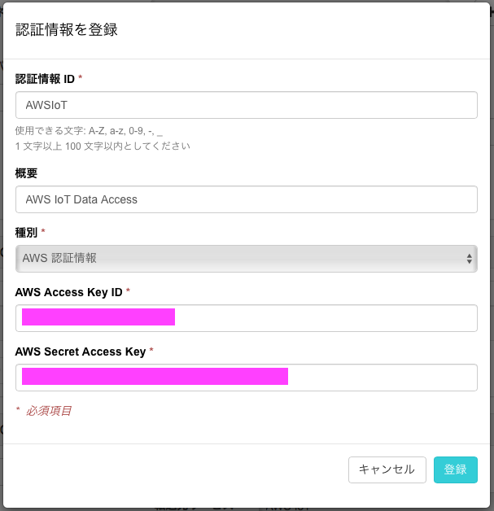

最後に 保存 を押せば、設定完了となります。

## 送信された生データを確認する
#### Harvest の特に使用したスケッチをそのまま使います。デバイスからデータを送信している状態で、進めてください。

- AWS IoT のコンソールを開き、左側のメニューの[テスト](https://ap-northeast-1.console.aws.amazon.com/iot/home?region=ap-northeast-1#/test) をクリックします
- トピックのサブスクリプションで、トピック名 `sensor` を指定し「トピックへのサブスクライブ」をクリックします
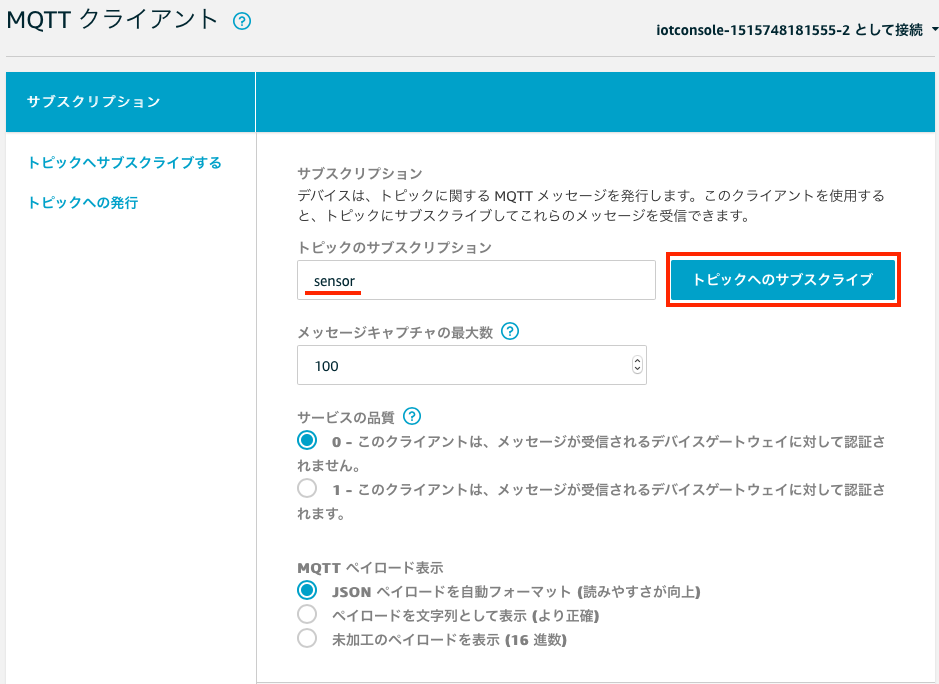

- １分に１度データが送信されているので、しばらく待つと受信した JSON データが表示されます
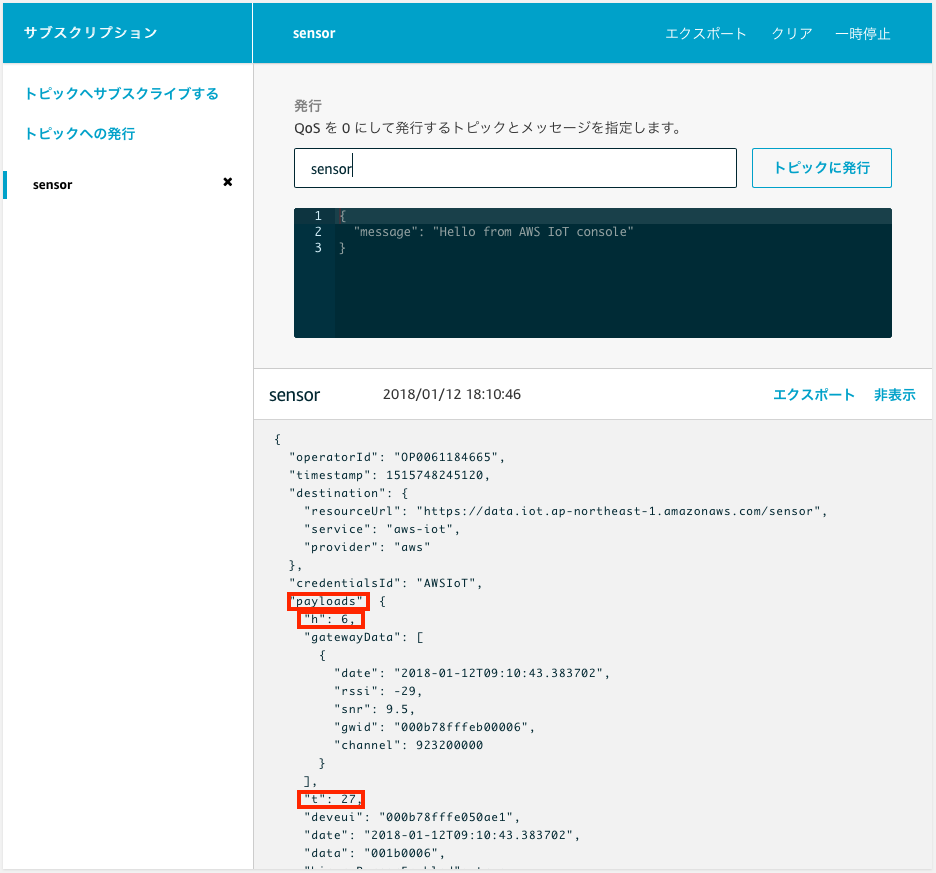

> payloads の中に、h や t が数値として含まれている事を確認してください

## アクションの作成
- AWS IoT コンソールの左側のメニューから、ACT をクリックして、ルールを [作成](https://ap-northeast-1.console.aws.amazon.com/iot/home?region=ap-northeast-1#/create/rule)します
名前と説明は任意で入力します
属性に `*` 、トピックフィルターに `sensor` を指定します

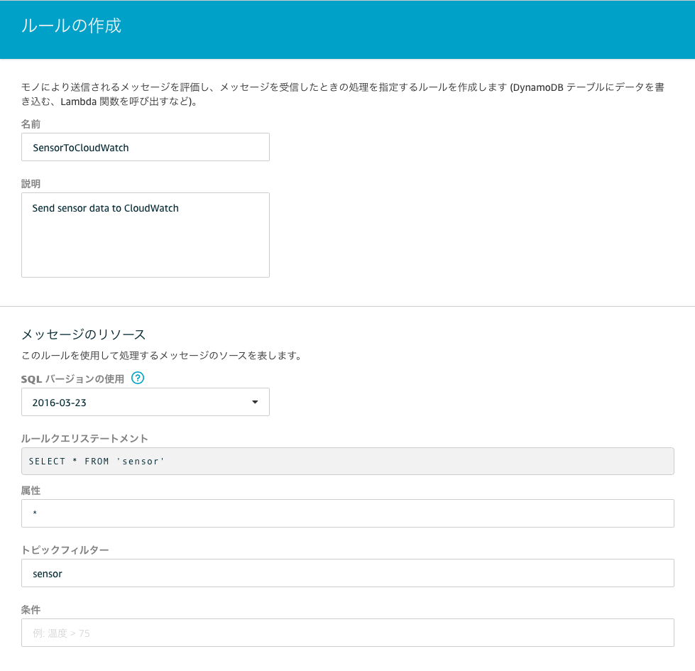

- アクションの追加を押し、「CloudWatch にメッセージデータを送信する」を選びます
- メトリクス名 `Humidity` 、メトリクス名前空間 `Sensor` 、単位 `Percent` 、値 `${payloads.h}` を指定します
- 新しいロールの作成をクリックし、任意の名前（「AWSIoTtoCloudWatch」など）を指定し、「新しいロールの作成」をクリックします
- IAMロール名から作成したロールを選択し、アクションの追加を押します

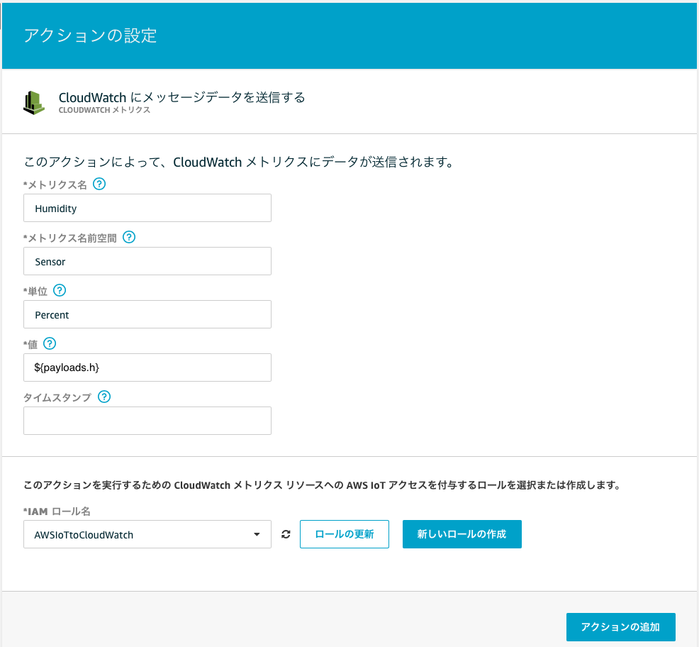

## メトリクスの確認
これで、データが CloudWatch に送られるはずなので、[CloudWatch コンソール](https://ap-northeast-1.console.aws.amazon.com/cloudwatch/home?region=ap-northeast-1)で確認してみましょう

- CloudWatch コンソールから[メトリクス](https://ap-northeast-1.console.aws.amazon.com/cloudwatch/home?region=ap-northeast-1#metricsV2:)のリンクを開き、カスタム名前空間から `Sensor` を選びます
- 範囲の定められていないメトリクス ＞ Humidity を選択すると、上部にグラフが表示されます

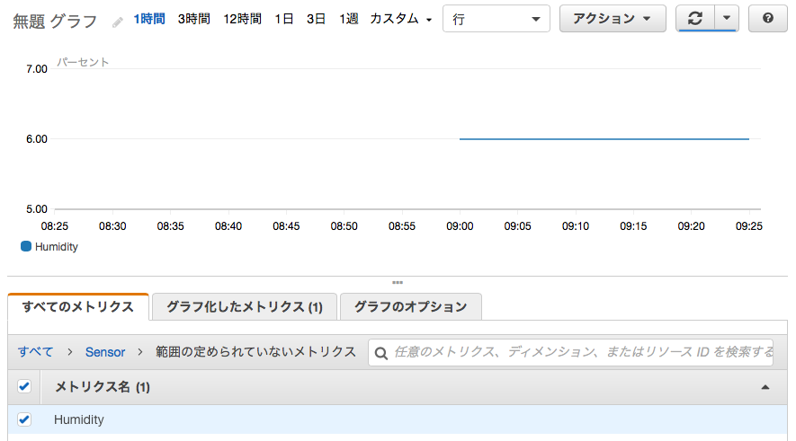

### Try:
- 「グラフ化したメトリクス」タブを選択し、期間を「１分」に変更してみましょう
-  右上のドロップダウンから、自動更新間隔を指定すると、自動的にグラフが更新されます
- 「グラフのオプション」タブから、左のY軸の最小・最大を 0 と 100 にするとわかりやすいでしょう
- 「水平の注釈」で基準線を引く事が出来ますので、例えば 40 % のところに線を引いてみましょう

#### トラブルシュート; Sensor が出てこない場合

* 反映が遅い場合があるので、数分間待ってみましょう

## メトリクスアラームの設定
- グラフ化したメトリクスタブの、右側のアクションから、ベルのマークをクリックします
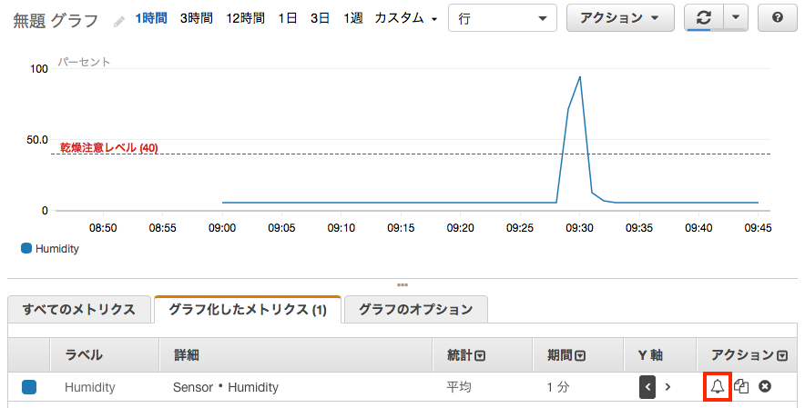

- アラームの作成画面が開きますので、以下のように設定します
### アラームのしきい値
名前： LowHumidty (任意)
説明： Humidty is lower than 40 (任意)
次の時： 不等号を「＜」、数字を 40 に指定

### 追加設定
欠落データの処理方法: 無視（アラーム状態を維持する）

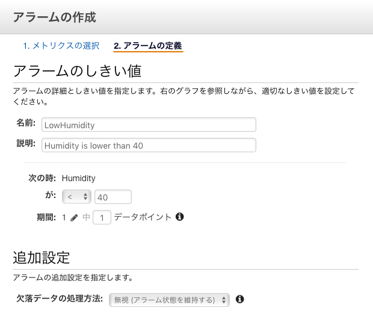

### アクション設定
アラームが次の時： 「状態: 警告」
通知の送信先： 「新しいリスト」をクリックし、リストの名前(任意)を指定 例) LowHumidity
メールリスト： メールアドレスを入力

> アラームが次の時： 「状態： OK」でも、同じ設定を行う

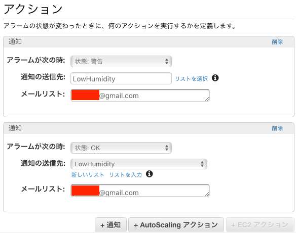

最後に「アラームの作成」をクリック

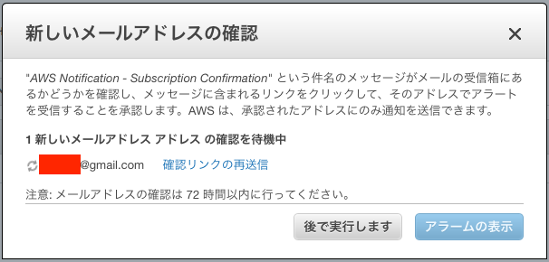

入力したアドレスに確認メールが届くので、"Confirm subscription" のリンクをクリックすると、設定完了

湿度を変化させてみて、アラートメールが飛ぶことを確認しましょう。

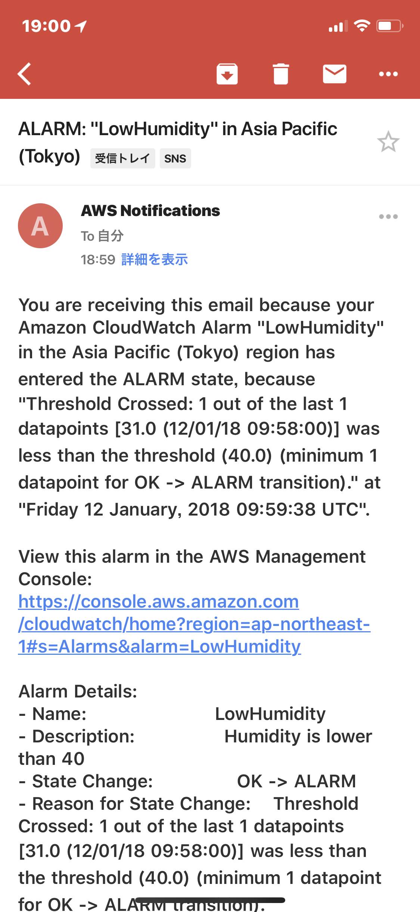

# あとかたづけ

## 1. SORACOM Harvestの設定をする

SORACOM Harvestは有料のサービスです  
ハンズオンが終了したら**必ず設定を確認し、不要な課金が発生しないよう**にしてください

### LoRaグループにSORACOM Harvestの設定を施す

**Menu > LoRaグループ** をクリックすると、LoRaグループ一覧が表示されます  
LoRaグループ一覧の中から `lora_demo0` をクリックします

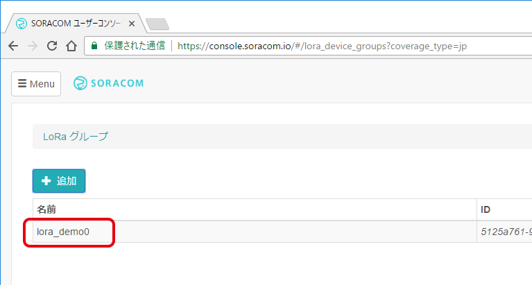

**SORACOM Harvest 設定** を下記の通りにした後 **保存** をクリックしてください  
※ONの時に出た様なダイアログは出ません

* **OFF**


### オプション; LoRaグループを削除する

LoRaグループ自体には費用は発生しませんが、不要な課金を避けるためにも削除をお勧めします

手順は以下の通り

1. 削除対象のLoRaグループに所属しているLoRaデバイスをすべて解除する
2. 削除対象のLoRaグループを表示し **高度な設定** から削除を実行する

## 2. CloudWatch Alarm を消す
CloudWatch Alarm は 10 個までは無料枠に含まれますが、もし不要であれば削除しましょう

CloudWatch のコンソールで、設定したアラームを選択し、アクションから削除、で消すことが出来ます。

# Appendix: Arduino IDEのインストールと起動方法

## ダウンロード＆インストール

[Download the Arduino IDE](https://www.arduino.cc/en/main/software)から、OSにあったファイルをダウンロードし、インストールしてください

- "Support the Arduino Software" のページで **JUST DOWNLOAD** を選べばダウンロードできます (ぜひとも貢献をご検討ください)
- Windowsの場合: *Windows Installer* が無難です。また、管理者権限でインストールしてください
- macOSの場合: インストール時に *Java SE* も同時にインストールを要求される場合がありますが、Java SEもインストールしてください

## 起動方法

インストールが終われば 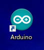 がデスクトップやスタートメニューに現れるので、これで起動可能です

# Appendix: LoRa Arduino 開発シールド(AL-050) の購入後の登録

LoRa開発シールドのDevEUI(LoRaWANにおけるデバイスID)はソラコムで管理※しており、ご利用者が直接管理する必要がありません  
その代わりに、ご購入いただきLoRa開発シールドがお手元に届きましたら **受け入れ** をソラコムコンソールから行っていただく必要があります  
_※2017年4月現在_

**Menu > 発注** をクリックしてください。受け入れ可能なLoRa開発シールドには _受け取り確認_ が表示されているので、**受け取り確認**をクリックしてください

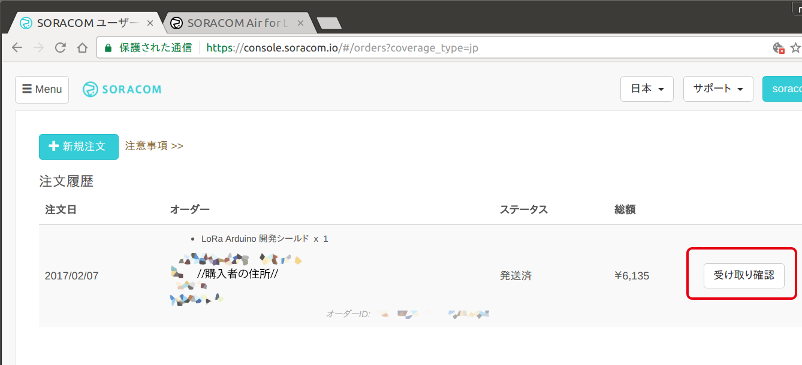

これで **Menu > LoRaデバイス管理** に受け取り確認ができたデバイスが一覧に表示され、利用準備が整います

詳細は[LoRaWAN ゲートウェイ/デバイス ハードウェアセットアップガイド](https://dev.soracom.io/jp/start/lora_hw/)をご覧ください

# Appendix: バイナリパーサー設定
今回バイナリパーサー設定として、`t:0:uint:16 h::uint:16` を指定していますが、これは以下のような意味となります。

- 0 バイトめから、16 bit 分を取り、uint(±のない正の整数) として解釈し、それを "t" というパラメータとする
- 続き(17bitめ)から、16 bit 分を取り、uint(±のない正の整数) として解釈し、それを "h" というパラメータとする

こうすることで、送信時に

```
p = ( (unsigned long)temperature << 16 ) + (unsigned long)humidity;
```

として、１つのデータにした温度と湿度のデータを分離する事が出来ます

例えば、001b0032 というデータがあったとしたら、

```
0x001b = 27 度
0x0032 = 50 ％
```

となります。
